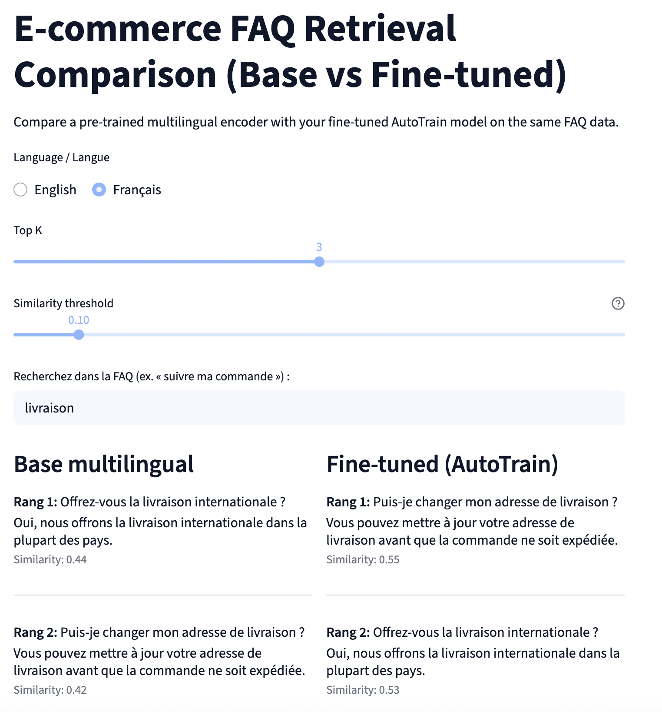

[tags: python-3.13, streamlit-1.51, autotrain, huggingface-hub, local-llm]

# FAQ Retrieval Apps (Base vs Fine-tuned)

Two Streamlit apps to serve and compare an FAQ semantic search workflow:
- `faq_streamlit.py`: main RAG-style app (top-3 retrieval + optional LLM answer).  
=> https://arnoweb-rag-llm-faq-finetuned-huggingface.streamlit.app/

<div>
    <a href="https://www.loom.com/share/1bf5e89c54e24e29840d1a3067461c83">
      <p>FAQ IA Demo - Watch Video</p>
    </a>
    <a href="https://www.loom.com/share/1bf5e89c54e24e29840d1a3067461c83">
      
    </a>
  </div>

- `faq_compare_streamlit.py`: side-by-side comparison of a base multilingual encoder vs your fine-tuned AutoTrain model.  
=> https://arnoweb-rag-faq-compare-basevsfinetuned-huggingface.streamlit.app/




Models used
- Pre-fine-tuning: `sentence-transformers/paraphrase-multilingual-mpnet-base-v2`
- Fine-tuned: `arnoweb/model-faq-sentence-autotrain` (Hugging Face Hub) — fine-tuned from the model above

Data used
- Live FAQ content: `data/faq_source_en.jsonl`, `data/faq_source_fr.jsonl`
- Eval set: `data/faq_evaluation.jsonl`

## Prerequisites
- Python 3.13 to run the apps (`requirements.txt`). Fine-tuning a new model locally requires Python 3.11 instead (`requirements-train.txt`) — `autotrain-advanced` pins `sentencepiece==0.2.0`, which has no Python 3.13 wheel.
- pip/venv
- Hugging Face Hub access if the fine-tuned repo is private (`huggingface-cli login` or `HUGGINGFACE_HUB_TOKEN`)
- Optional: a local LLM server exposing an OpenAI-compatible `/v1/chat/completions` endpoint at `http://localhost:1234` (e.g., LM Studio, llama.cpp, Ollama)
- Optional: a remote LLM server exposing an OpenAI-compatible `/v1/chat/completions` endpoint

## Install

#### Connect to HuggingFace
```bash
echo 'export HF_USERNAME="your-username"' >> ~/.zshrc && echo 'export HF_TOKEN="hf_key"' >> ~/.zshrc
```

#### Install python env (to run the apps)
```bash
python3 -m venv .venv
source .venv/bin/activate
pip install --upgrade pip
pip install -r requirements.txt
```

#### Install python env (to fine-tune a new model — needs Python 3.11)
```bash
python3.11 -m venv .venv-train
source .venv-train/bin/activate
pip install --upgrade pip
pip install -r requirements-train.txt
```

## Run the main FAQ RAG app
```bash
source .venv/bin/activate
streamlit run faq_streamlit.py --server.port 8501 --server.address 0.0.0.0
```
- Retrieval: SentenceTransformer embeddings over the FAQ JSONL for the selected language.
- Search-as-you-type via [`streamlit-searchbox`](https://github.com/m-wrzr/streamlit-searchbox): matching FAQ entries appear live in a dropdown as you type (debounced), no need to press Enter — select one to see the full answer.
- Generation (optional): calls `query_local_llm` to your local LLM endpoint.

### Local LLM connection (LM Studio example)
- In LM Studio, start a model and enable the OpenAI-compatible server (default `http://localhost:1234/v1/chat/completions`).
- The app already calls that URL. If you change the port/host, update `query_local_llm` in `faq_streamlit.py`.
- No API key is read from env by default; add headers in `query_local_llm` if your server requires one.

## Run the comparison app (base vs fine-tuned)
```bash
source .venv/bin/activate
streamlit run faq_compare_streamlit.py --server.port 8502 --server.address 0.0.0.0
```
- Shows top-K results from both models side by side on the same FAQ data.
- Adjust K and a similarity threshold to flag low-confidence matches.

## Evaluate models on the held-out set
```bash
source .venv/bin/activate
python evaluate_models_compare.py
```
- Reports MRR, Recall@1/3/5, and mean similarity overall and per language.
- Warns if any eval answers are missing from the FAQ files.

### Visualize training metrics with TensorBoard
If you have training logs in `model-faq-sentence-autotrain/runs`, you can inspect them with (from the training env, `.venv-train`, which includes `tensorboard`):
```bash
source .venv-train/bin/activate
tensorboard --logdir model-faq-sentence-autotrain/runs
```
Open the local URL printed by TensorBoard to view losses/metrics over time.
- Train loss vs eval/validation loss: train loss measures fit on the training batches; eval loss measures generalization on held-out data. Watch them over epochs.
- Epochs and steps: one epoch = one full pass over the training set; steps are the mini-batch updates inside each epoch.
- Interpreting curves:
  - If both losses decrease smoothly (less noise) across steps/epochs, the model is learning useful structure.
  - If eval loss bottoms out then rises while train keeps dropping toward zero, that signals overfitting.
  - Extremely small losses on train and eval can also indicate overfitting or a trivial task; prefer a modest gap and stable eval loss.

## Evaluation Metrics

### MRR (Mean Reciprocal Rank)
Measures how highly the correct answer is ranked.  
A score closer to 1 means the model places the correct answer near the top of the results list.

### Recall@K
Indicates whether the correct answer appears within the top K returned results.  
- **Recall@1**: the correct answer is the first result  
- **Recall@3 / Recall@5**: the correct answer is within the top 3 or top 5  
Higher values mean the model retrieves relevant answers more reliably.

### Mean True Similarity
Represents the average similarity (e.g., cosine similarity) between each query and its correct answer.  
Higher scores indicate a better semantic understanding between questions and their corresponding answers.

---

## Example Results

**Same base encoder, before and after fine-tuning.** `Pre-fine-tuning` is the exact checkpoint
(`paraphrase-multilingual-mpnet-base-v2`, unmodified) the fine-tuned model started from — verified against
the Hub (`XLMRobertaModel`, hidden_size 768, 12 layers, identical on both sides). This is the only fair
comparison for isolating what fine-tuning itself changed.

Measured on 100 FAQ entries per language (`data/faq_source_en.jsonl`, `data/faq_source_fr.jsonl`) and 44
evaluation queries (`data/faq_evaluation.jsonl`), a mix of verbatim and genuinely reworded questions.

| Model                    | MRR   | Recall@1 | Recall@3 | Recall@5 | Mean True Sim | Explanation |
|---------------------------|-------|----------|----------|----------|----------------|-------------|
| Pre-fine-tuning (global)  | 0.759 | 0.659    | 0.818    | 0.864    | 0.628          | The "before" state — same architecture as the fine-tuned model. |
| Fine-tuned (global)       | 0.901 | 0.841    | 0.955    | 0.977    | 0.671          | Large, consistent gain across every metric after fine-tuning. |
| Pre-fine-tuning [en]      | 0.794 | 0.682    | 0.864    | 0.909    | 0.643          | The "before" state for English. |
| Fine-tuned [en]           | 0.891 | 0.818    | 0.955    | 0.955    | 0.683          | Clear improvement in ranking and similarity. |
| Pre-fine-tuning [fr]      | 0.723 | 0.636    | 0.773    | 0.818    | 0.614          | The "before" state for French. |
| Fine-tuned [fr]           | 0.911 | 0.864    | 0.955    | 1.000    | 0.660          | French now matches or exceeds English after fine-tuning on matching data. |

**Note on the underlying model (resolved):** an earlier version of the deployed fine-tuned model had actually
been trained on a different, unrelated FAQ dataset (leftover from an earlier experiment) instead of the FAQ
content above. This has been fixed: `data_autotrain/faq_train.jsonl` and `faq_validation.jsonl` were
regenerated from the corrected, expanded data, the model was re-trained locally
(`autotrain --config models/config/config.yml`, Python 3.11 env), and the retrained model was pushed to
`arnoweb/model-faq-sentence-autotrain` — verified with a fresh download (no local cache) to confirm the
numbers above match what's actually served in production.

The isolated fine-tuning effect (`Pre-fine-tuning` → `Fine-tuned`, same architecture) is now large across
every metric — Recall@1 alone jumps from 0.66 to 0.84 globally — confirming that fine-tuning on matching
domain data is what actually drives the improvement, not just a bigger base model.

## Notes
- If your fine-tuned HF repo is private, ensure `huggingface-cli login` (or set `HUGGINGFACE_HUB_TOKEN`).
- To swap models, edit `MODEL_PATHS` in `faq_compare_streamlit.py` and `model_path` in `faq_streamlit.py`.

## Architecture
See [docs/architecture.html](docs/architecture.html) for the full technical architecture (data pipeline, AutoTrain fine-tuning, model registry, serving apps, and optional LLM generation).

See [docs/business-value.html](docs/business-value.html) (FR) / [docs/business-value-en.html](docs/business-value-en.html) (EN) for the functional overview (use cases, value vs a standard FAQ, target companies).
